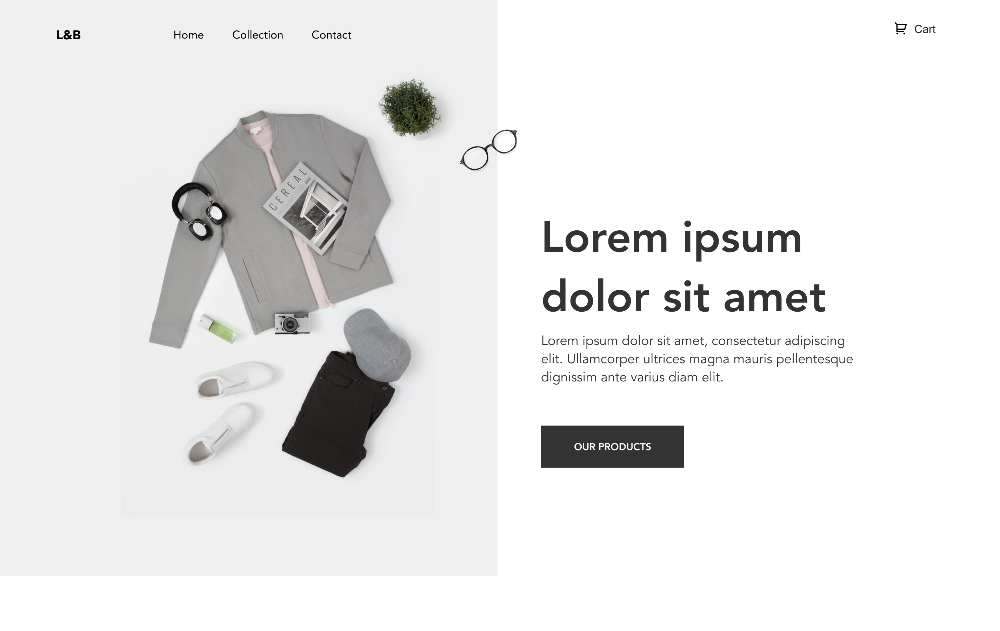

# e-commerce


### Screenshot



### Links

- Solution URL: [Solution URL](https://www.frontendmentor.io/solutions/githubusersearchappsolution-ONG4D0r5o)
- Live Site URL: [Live site URL](https://aliabuhumra.github.io/GitHub-user-search-app-solution/)

## Table of contents

- [Overview](#overview)
  - [The challenge](#the-challenge)
  - [Screenshot](#screenshot)
  - [Links](#links)
- [My process](#my-process)
  - [Built with](#built-with)
  - [What I learned](#what-i-learned)
  - [Continued development](#continued-development)
- [Author](#author)

## Overview

### Intro

Hello! This is my solution to [Bookmark landing page - Frontend Mentor](https://www.frontendmentor.io/challenges/bookmark-landing-page-5d0b588a9edda32581d29158)

### The challenge

> Your challenge is to build out this landing page and get it looking as close to the design as possible.
>
> You can use any tools you like to help you complete the challenge. So if you've got something you'd like to practice, feel free to give it a go.

Users should be able to:

- View the optimal layout for the site depending on their device's screen size
- See hover states for all interactive elements on the page

## My process

### Built with

- ReactJS
- Tailwindcss
- Mobile first
- Semantic HTML5 markup
- hooks
- Flexbox
- Strip Library API

### Features

- I used React hooks [useState , useEffect , useLocation, useContext]
- useState : is a variable that may be change or update later
- useEffect : The useEffect hook lets you perform an effect in your component
  - Here are some examples of effects:
    - Get data from an API
    - Initialize a DOM plugin outside of React (for example maps, we'll see it in the next Project)
    - Change the page title (the one that shows up in the browser tab)
    - Subscribe a user to live chat service (with WebSockets)
    - They are called effects because they are instructions running outside your component and/or as a result of your component
- useLocation :

  - What if you need to run a piece of code whenever React Router navigates to a new URL?
  - You can do that with the useLocation hook.
    - run a piece of code on location change
    - This hook returns the location object used by the react-router.
    - This object represents the current URL and is immutable.
    - Whenever the URL changes, the useLocation() hook returns a newly updated location object.<br/>
      `useEffect(() => { console.log(location.pathname);// send it to analytic, or do some conditional logic here }[location]);`

- I used react router, [BrwoserRoute , Routes , Route , Link , params]
  This is part of the code I was facing the challenge with

- I used strip library for checkout and redirect

- Add scroll-behavior:
  smooth to the <html> element to enable smooth scrolling for the whole page (note: it is also possible to add it to a specific element/scroll container):

<details>
    <summary>:zap: Sucessfuly to add purgeCSS to unused css tailwindcss</summary>
     ```
    "postbuild": "purgecss --css build/static/css/_.css --content build/index.html build/static/js/_.js --output build/static/css",

    "sass-compile": "sass --watch src/scss/style.scss:assest/style.css",
    "post": "purgecss --css build/static/css/_.css --content build/index.html   build/static/js/_.js --output build/static/css"

    ```

</details>
<summary>:zap: Preload important resources تحميل الموارد الهامة مسبقا
</summary>
  - [Link - Netlify](https://web.dev/optimize-lcp/?utm_source=lighthouse&utm_medium=devtools#preload-important-resources)
<details>

</details>
- I faced problems with netlify router , He needed to get him on the right track, Because the local path is different from the path in the host netlify,
I found the solution to the problem in this link
  - [Link - Stackoverflow](https://stackoverflow.com/questions/55990467/catch-all-redirect-for-create-react-app-in-netlify)
  - [Link - Netlify](https://play.netlify.com/redirects)

### Useful resources

- [DOCS - ReactJS](https://reactjs.org/)
- [Doc - React router](https://reactrouter.com/docs/en/v6)
- [LINK - async/defer](https://flaviocopes.com/javascript-async-defer/#the-position-matters)
- [LINK - scroll-behavior ](https://www.w3schools.com/howto/howto_css_smooth_scroll.asp)
- [DOCS - strip library](https://stripe.com/docs)
- [Link - Tailwindcss](https://tailwindcss.com/)

## Author

- Website - [Github/AliAbuhumra](https://github.com/aliabuhumra)
- Frontend Mentor - [@AliAbuhumra](https://www.frontendmentor.io/profile/aliabuhumra)
- Twitter - [@AliAbuhumra](https://twitter.com/aliabuhumra)

Thanks for checking out this project.
